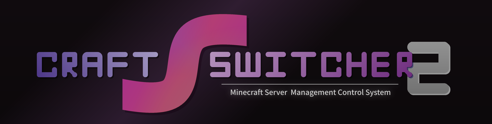

<div align="center">
  <picture>
    <source media="(prefers-color-scheme: dark)" srcset="icons/header_nobg.png">
    <source media="(prefers-color-scheme: light)" srcset="icons/header_nobg_light.png">
    
  </picture>

  Minecraft Java サーバー 管理システム |
  <a href="https://github.com/Necnion8/dnCoreV6">DNC6</a>プラグイン実装
  <br>
  本体コードは <a href="dncore%2Fextensions%2Fcraftswitcher">dncore/extensions/craftswitcher</a> にあります
</div>

---
## 開発中
- [x] DNC6プラグイン化
- [x] サーバープロセスの操作ラッパー
- [x] REST API + WebSocketイベント
- [x] ファイル管理
- [x] アーカイブファイルの対応
- [x] サーバーのインストール
- [ ] バックアップ機能
  - [x] 設定とデータベースの作成
  - [x] フルバックアップ
  - [x] スナップショット
  - [ ] ゴミ箱
  - [x] データのリストア
- [ ] スケジューラ機能
  - 大体のイメージはOK。ただし、実装の構想イメージが不足
- [ ] サーバー内連携モジュール
  - [x] 旧版の連携機能を一時的に移植実装
  - [ ] v2 連携機能の実装と旧版実装を削除
- [ ] Discordコマンド
  - 実装待ち
- [ ] リリース！

---
## 主な機能
- Web UI
- Discord ボット (オプション)
- サーバー内 連携API
- ファイル操作
- パフォーマンスモニター
- バックアップとスケジュール機能


## 環境
- Python 3.10
- Linux (推奨)
- Windows

※ macOSは未確認。おそらく動作？

## 対応サーバー
| サーバー               | 基本操作 | 鯖内連携<sup>※2</sup> |                  ダウンロード                   |                             開発元                              |
|:-------------------|:----:|:-----------------:|:-----------------------------------------:|:------------------------------------------------------------:|
| Vanilla            |  〇   |         ✕         |                     〇                     | [Minecraft](https://www.minecraft.net/ja-jp/download/server) |
| Spigot             |  〇   |    1.8 ~ 1.17     | 〇<sup style="position:absolute;">※1</sup> |    [SpigotMC](https://www.spigotmc.org/wiki/buildtools/)     |
| Paper              |  〇   |    1.8 ~ 1.17     |                     〇                     |         [PaperMC](https://papermc.io/software/paper)         |
| Purpur             |  〇   |    1.8 ~ 1.17     |                     〇                     |              [PurpurMC](https://purpurmc.org/)               |
| Folia              |  〇   |         ✕         |                     〇                     |         [PaperMC](https://papermc.io/software/folia)         |
| # ***mod***        |
| Forge              |  〇   |         ✕         | 〇<sup style="position:absolute;">※1</sup> |     [Minecraft Forge](https://files.minecraftforge.net/)     |
| Mohist             |  〇   |         ✕         |                     〇                     |       [MohistMC](https://mohistmc.com/software/mohist)       |
| NeoForge           |  〇   |         ✕         | 〇<sup style="position:absolute;">※1</sup> |             [NeoForged](https://neoforged.net/)              |
| Youer<sup>※3</sup> |  ?   |         ✕         |                     ?                     |       [MohistMC](https://mohistmc.com/software/youer)        |
| Fabric             |  〇   |         ✕         |                     〇                     |              [FabricMC](https://fabricmc.net/)               |
| Quilt              |  〇   |         ✕         | 〇<sup style="position:absolute;">※1</sup> |               [QuiltMC](https://quiltmc.org/)                |
| Banner             |  〇   |         ✕         |                     〇                     |       [MohistMC](https://mohistmc.com/software/banner)       |
| # ***proxy***      |
| BungeeCord         |  〇   |         〇         |                     〇                     |    [SpigotMC](https://www.spigotmc.org/wiki/bungeecord/)     |
| Waterfall          |  〇   |         〇         |                     〇                     |       [PaperMC](https://papermc.io/software/waterfall)       |
| Velocity           |  〇   |         ✕         |                     〇                     |       [PaperMC](https://papermc.io/software/velocity)        |

<sup>※1</sup>ビルドが必要ですが、自動でセットアップします<br>
<sup>※2</sup>旧版連携モジュールで仮対応<br>
<sup>※3</sup>正式リリースされてないため未確認

## 導入と起動
```bash
# Install
python3 -m pip install -r requirements.txt

# Launch
python3 -m dncore
```
初回の起動時に以下のファイルが生成されます。
- `./config/config.yml` - dnCore設定
- `./plugins/CraftSwitcher/config.yml` - メイン設定


### Discord
Discord機能を利用しない場合は[無効にする方法](https://github.com/Necnion8/dnCoreV6/wiki/No-Connect-Discord)を参照ください。

### REST API
REST API は初期設定で [`http://0.0.0.0:8080/docs`](http://localhost:8080/docs) に公開されています。


## WebSocket
WebSocket クライアントを `http://0.0.0.0:8080/api/ws` に接続することで、サーバーイベント等を JSON フォーマットで受信できます。

### WS 受信
> [craftswitcher.py](dncore%2Fextensions%2Fcraftswitcher%2Fcraftswitcher.py)<br>
> `# events ws broadcast` このコメント行の以下に実装があります


### WS 送信
> サーバープロセスへのテキストの書き込み
> ```json
> {
>   "type": "server_process_write",
>   "server": "lobby",
>   "data": "say Hello\r\n"
> }
> ```
